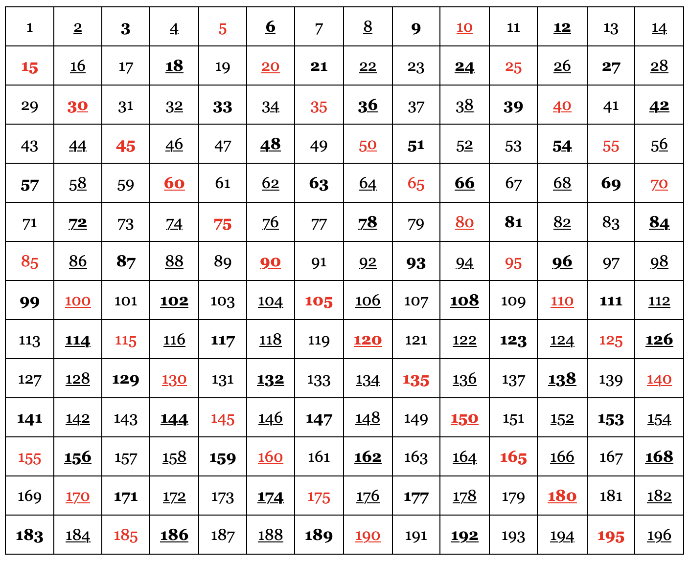

# vierkant met getallen

Je krijgt voor deze opgave de HTML, de CSS en de startregel van het student.js bestand. Je schrijft code in student.js die een vierkant met de gegeven zijde maakt met opeenvolgende getallen, startend met 1. Dit moet het ongeveer worden:

Het ligt voor de hand om dit vierkant te maken via een HTML-tabel. Bekijk zeker even hoe je een tabel maakt in HTML. De elementen die je nodig hebt zijn table, tr en td. 

Bestudeer de CSS goed. Veelvouden van 2, 3 en 5 worden via een class anders getoond (vet, onderlijnd of in het rood).

Tips:
- Werk met functions (klassiek of vette pijl maakt niet uit)
- Deel het probleem op in deelproblemen: een tabel bestaat uit rijen, een rij bestaat uit aparte cellen …
- De variabele bovenaan student.js geeft de zijde van het vierkant. Als je die waarde wijzigt, wijzigt ook het formaat van het vierkant.